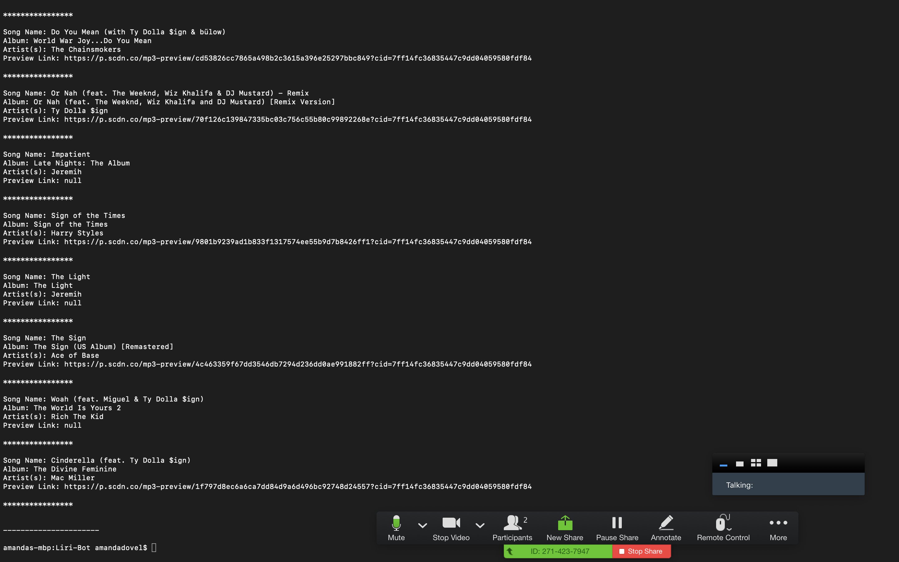

# Liri-Bot 🤖

 LIRI is like iPhone's SIRI. However, while SIRI is a Speech Interpretation and Recognition Interface, LIRI is a Language Interpretation and Recognition Interface. LIRI is a command line node app that takes in parameters and gives you back data.


## Functionality 💪
#### Here's how the app works: 
1. Get concert data 
`node liri.js concert-this <artist/band name here>`
    1.1. This will search the Bands in Town Artist Events API ("https://rest.bandsintown.com/artists/" + artist + "/events?app_id=codingbootcamp") for an artist and render the following information about each event to the terminal:
        - Name of the venue
        - Venue location
        - Date of the Event (use moment to format this as "MM/DD/YYYY")

```
axios.get(queryURL)
    .then(function (response) {
        var events = response.data;
        if (events.length > 0) {
            console.log("\n----------------------\n");
            console.log(command);
            console.log(userInput);
            console.log("\n----------------------\n");
            events.forEach(function (event) {
                console.log("\n****************\n");
                console.log("Venue:", event.venue.name)
                console.log("Location:", event.venue.city, + "," + event.venue.region, event.venue.country)
                console.log("Date:", moment(event.datetime).format("MM/DD/YYYY"))
                console.log("Time:", moment(event.datetime).format("hh:mm A"))
            })
            console.log("\n****************\n");
            console.log("\n----------------------\n");

        } else {
            console.log("Sorry, no concert data was found for " + userInput + ". Try another band.")
        }
    })
```


2. Get song data 
`node liri.js spotify-this-song '<song name here>'`

    2.1. This will show the following information about the song in your terminal/bash window
        - Artist(s)
        - The song's name
        - A preview link of the song from Spotify
        - The album that the song is from

```
if (songs.length > 0) {
    console.log("\n----------------------\n");
    console.log(command);
    console.log(userInput);
    console.log("\n----------------------\n");
    songs.forEach(function (song) {
        console.log("\n****************\n");
        console.log("Song Name:", song.name)
        console.log("Album:", song.album.name)
        console.log("Artist(s):", song.artists[0].name)
        console.log("Preview Link:", song.preview_url)

    })
    console.log("\n****************\n");
    console.log("\n----------------------\n");
```

3. Get movie data 
`node liri.js movie-this '<movie name here>'`

    3.1. This will output the following information to your terminal/bash window:
        * Title of the movie.
        * Year the movie came out.
        * IMDB Rating of the movie.
        * Rotten Tomatoes Rating of the movie.
        * Country where the movie was produced.
        * Language of the movie.
        * Plot of the movie.
        * Actors in the movie.

    3.2. If the user doesn't type a movie in, the program will output data for the movie 'Mr. Nobody.'

```
if (movie.Response === "False") {
    console.log("Sorry, no movie data found for " + userInput + ". Try another movie title.")
} else {
    console.log("\n----------------------\n");
    console.log(command);
    console.log(userInput);
    console.log("\n----------------------\n");
    console.log("\n****************\n");
    console.log("Title:", movie.Title)
    console.log("Release Year:", movie.Year)
    console.log("IMDB Rating:", movie.Ratings[0].Value)
    console.log("Rotten Tomato Rating:", movie.Ratings[1].Value)
    console.log("Production Country:", movie.Country)
    console.log("Language:", movie.Language)
    console.log("Plot:", movie.Plot)
    console.log("Actors:", movie.Actors)
    console.log("\n****************\n");
    console.log("\n----------------------\n");
}
```

4. Do what it says
 `node liri.js do-what-it-says`

    4.1 Using the fs Node package, LIRI will take the text inside of `random.txt` and then use it to call one of LIRI's commands.


    4.2 It should run `spotify-this-song` for `"I Want it That Way,"` as follows the text in `random.txt`.
    
    4.3 Edit the text in `random.txt` to test out the feature for `movie-this` and `concert-this`.

```
if (data.length > 0) {
var content = data.split(",");
if (content.length === 1) {
    var liriCommand = content[0];
    var liriInput = null;
    actionLog(liriInput);
    startLiri(liriCommand, liriInput);
} else {
    var liriCommand = content[0];
    var liriInput = content[1];
    actionLog(liriInput);
    startLiri(liriCommand, liriInput);
}
```


## Getting Started 🏁

These instructions will get you a copy of the project up and running on your local machine for grading and testing purposes. 

1. clone repository. 
2. open repository in your IDE of choice.


## Pre-Requisites 

1. NPM 
2. Node
3. Create .env file. 


## Built With 🔧

* [Axios](https://www.npmjs.com/package/axios) - Promise based HTTP client for the browser and node.js


## Authors ⌨️


* **Amanda Dovel** - [amandadovel](https://github.com/amandadovel)

## Acknowledgments 🌟

* Amber Burroughs, Tutoring badass
